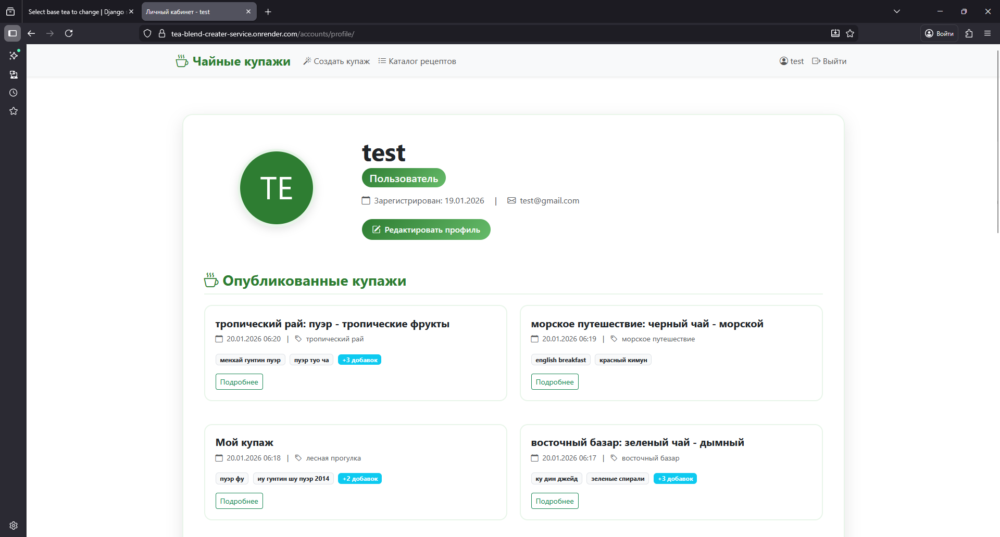
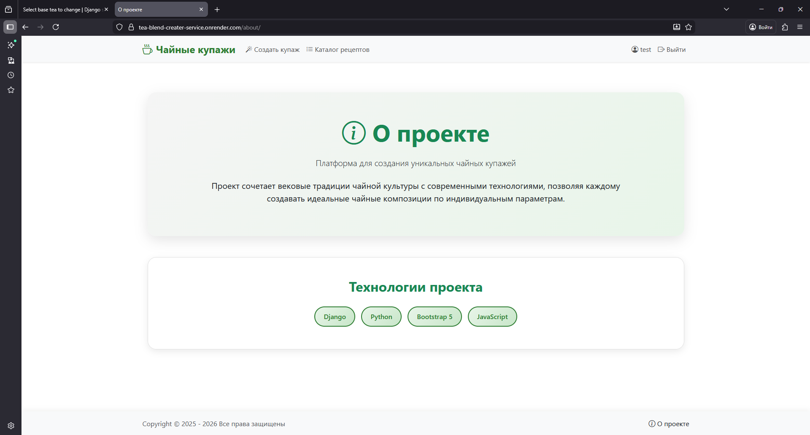
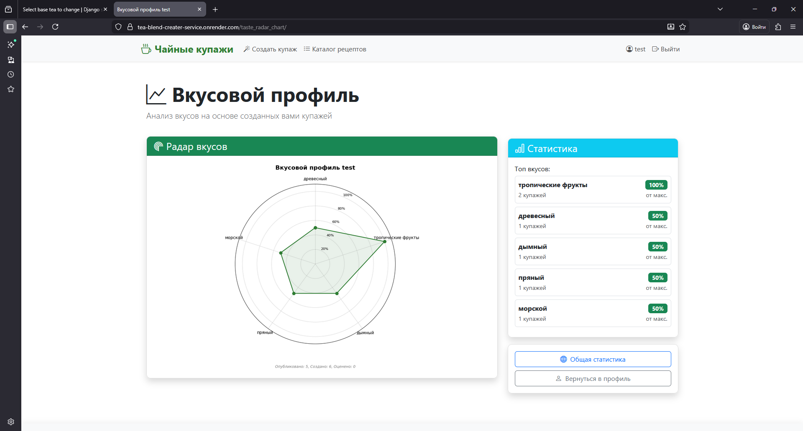
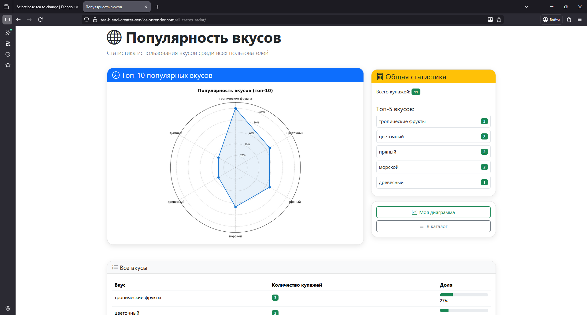

# Чайные купажи

Сервис для алгоритмического составления персонализированных чайных купажей, который решает проблему сложности создания сбалансированных чайных смесей для неподготовленных пользователей. Сервис преобразует выбранные пользователем параметры в оптимальные составы смесей через алгоритмы.

**Ссылка на рабочий проект:** https://tea-blend-creater-service.onrender.com

## Технологии
* **Python 3.12.3**
* **Django 6.0.1**
* **BeautifulSoup 4**
* **requests**
* **Bootstrap 5**
* **Matplotlib**

## Скриншоты

*Главная страница*


*Страница создания купажа*


*Страница каталога*


*Страница профиля*


*Страница о проекте*


*Страница вкусового профиля*


*Страница статистики сервиса*

## Как запустить проект локально
1. **Клонируйте репозиторий:**
   ```bash
   git clone https://github.com/NorseSway6/tea-blend-creater.git
   ```
2. **Создайте и активируйте виртуальное окружение:**
   ```bash
   python -m venv venv
   source venv/bin/activate  # для Linux/Mac
   venv\Scripts\activate     # для Windows
   ```
3. **Установите зависимости:**
   ```bash
   pip install -r requirements.txt
   ```
4. **Создайте .env файл и настройте его:**
   ```bash
   DJANGO_SUPERUSER_USERNAME = 'admin'
   DJANGO_SUPERUSER_EMAIL = 'admin@example.com'
   DJANGO_SUPERUSER_PASSWORD = 'password'
   SECRET_KEY = 'your_secret_key'
   ```
5. **Выполните миграции:**
   ```bash
   python manage.py migrate
   ```
6. **Создайте суперпользователя:**
   ```bash
   python create_superuser.py
   ```
7. **Запустите сервер:**
   ```bash
   python manage.py runserver
   ```
8. **Откройте проект в браузере:**
   Перейдите по ссылке: http://127.0.0.1:8000/

## Архитектура:
Приложения:

accounts - приложение аутентификации и авторизации пользователей на сайте. Содержит распределение ролей между пользователями.


blend_algorithms - приложение алгоритма подбора купажа на основе запроса пользователя.


main_functionality - основное приложение. Включает в себя основную часть фронтенда, миграции БД и основную логику работы сервиса.


parser - приложения для парсинга данных. В него входит парсинг с данных с сайта и команда заполнения БД данными.

Логика работы парсера:

При миграции запускается команда парсинга данных -> Данные заносятся в БД

