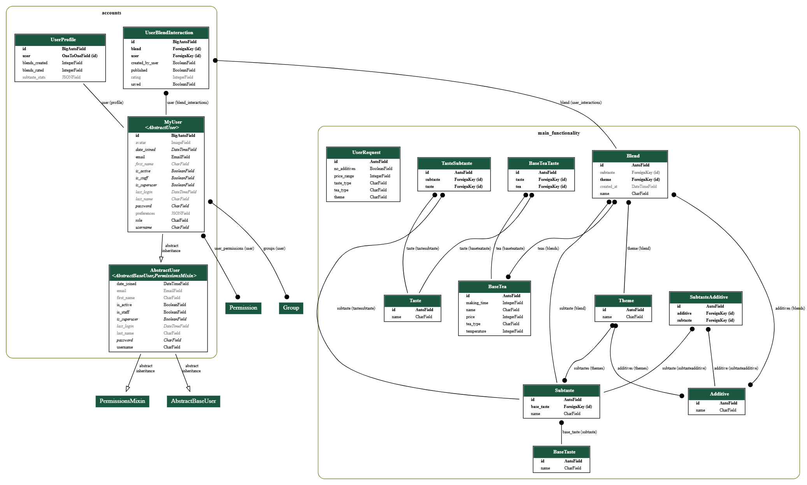

# Техническое задание на проект: "Tea blend creater"
## 1. Цель проекта:
Создание сервиса для алгоритмического составления персонализированных чайных купажей, который решает проблему сложности создания сбалансированных чайных смесей для неподготовленных пользователей. Сервис преобразует выбранные пользователем параметры в оптимальные составы смесей через алгоритмы.
## 2. Целевая аудитория и роли:
Сервис будет полезен для любителей чая и начинающих в составлении купажей

**Гость**: доступ к просмотру готовых купажей.

**Зарегестрированный пользователь**: доступ к заполнению вкусового профиля, составлению готовых купажей, а также возможность опубликовать составленный купаж и оценивать купажи от других зарегестрированных пользователей.

**Администратор**: доступ к управлению базой чайных компонентов, модерация пользовательского контента.

## 3. Модели данных:
Основное приложение:
1. UserRequest - запросы пользователей при отправки формы.
- Поля: theme, taste_type, tea_type, no_additives, price_range
2. Taste - словарь подкатегорий (например: пряный, цветочный, и т.д.) спаршенных чаев
- Поля: name
3. BaseTea - информация о чае
- Поля: name, tea_type, making_time, temperature, tastes (ManyToManyField), price
4. BaseTeaTaste - связующая сущность между таблицами BaseTea и Taste
- Поля: tea (ForeignKey), taste (ForeignKey)
5. Additive - словарь добавок к чаю 
- Поля: name
6. BaseTaste - словарь основных видов вкуса (например: соленый, горький)
- Поля: name, base_taste
7. Subtaste - словарь подкатегорий вкусов чая (например: пряный, цветочный, и т.д.)
- Поля: name, base_taste (ForeignKey)
8. SubtasteAdditive - связующая сущность между таблицами Subtaste и Additive 
- Поля: subtaste (ForeignKey), additive (ForeignKey)
9. TasteSubtaste - связующая сущность между таблицами Subtaste и Taste 
- Поля: taste (ForeignKey), subtaste (ForeignKey)
10. Theme - информация о тематиках составляемого купажа
- Поля: name, additives (ManyToManyField), subtastes (ManyToManyField)
11. Blend - информация о составленном купаже
- Поля: name, theme (ForeignKey), teas (ManyToManyField), additives (ManyToManyField), subtaste (ForeignKey), created_at, is_saved

Приложение авторизации и аутентификации пользователей:
1. MyUser (Abstract Uset) - кастомная модель для хранения данных пользователей
- Поля: role, email, avatar, preferences
2. UserProfile - статистика по профилю пользователя
- Поля: user (OneToOneField), blends_created, blends_rated, subtaste_stats
3. UserBlendInteraction - 
- Поля: user (ForeignKey), blend (ForeignKey), rating, saved, created_by_user, published

*ER-диаграмма моделей*

## 4. Ключевой функционал:
* Каталог: Пользователь может просматривать купажи, составленные зарагестрированными на сайте пользователями
* Форма составления купажа: Пользователь может выбрать параметры, на основе которых будет генерироваться купаж
* Система оценивания: Зарегестрированный пользователь оценивает купажи других зарегестрированных пользователей
* Статистика: зарегестрированный пользователь может посмотреть свой вкусовой профиль и общую статистику
## 5. Use Case:
1. Регистрация нового пользователя

Участник: Гость

Цель: Создать учетную запись для доступа к функциям сервиса

Основной сценарий:

    Пользователь переходит на страницу регистрации

    Заполняет форму (username, email, пароль)

    Система проверяет уникальность username и email

    Система проверяет сложность пароля

    Создается учетная запись с ролью «Пользователь»

    Автоматическая авторизация

    Перенаправление на страницу заполнения вкусового профиля

2. Создание чайного купажа

Участник: Пользователь

Цель: Сгенерировать купаж

Основной сценарий:

    Пользователь переходит на страницу создания купажа

    Заполняет форму параметров:

    Тема купажа (утренний, вечерний, праздничный)

    Тип вкуса (цветочный, пряный, фруктовый)

    Тип чая (зеленый, черный, улун)

    Максимальная цена

    Флаг «без добавок»

    Система валидирует данные формы

    Алгоритм подбирает компоненты

    Отображается результат с пропорциями и стоимостью

    Пользователь может: сохранить, опубликовать, сгенерировать заново или отменить создание купажа

3. Оценка купажей

Участник: Пользователь

Цель: Выразить мнение о купажах других пользователей

Основной сценарий:

    Пользователь просматривает каталог купажей

    Нажимает на звездочки (рейтинг 1-5)

    Система создает/обновляет запись

    Пересчитывается средний рейтинг купажа

    Увеличивается счетчик

4. Статистика

Участник: Пользователь

Цель: Узнать свой вкусовой профиль

Основной сценарий:

    Пользователь создает купажи

    Заходит в профиль

    Переходит по кнопке на страницу с диаграммой

    Смотрит свой вкусовой профиль на основе составленных купажей

5. Административное управление

Участник: Администратор

Цель: Управление контентом и пользователями

Сценарии:

    Модерация купажей:

    - Просмотр всех опубликованных купажей

    - Возможность удалить несоответствующий контент

    Управление компонентами:

    - Добавление новых видов чая через админ-панель

    - Редактирование существующих записей

    - Управление добавками и вкусовыми профилями

    Управление пользователями:

    - Просмотр статистики активности

    - Назначение ролей

## 6. Внешние интеграции / Аналитика:
- Интеграция: Использование парсинга сайта https://www.chay.info/ для получения информации о чае с использованием библиотеки BeautifulSoup
- Аналитика: Составление диаграммы вкусового профиля с помощью библиотеки Matplotlib на основе созданных пользователем купажей и общая статистика по всем пользователям